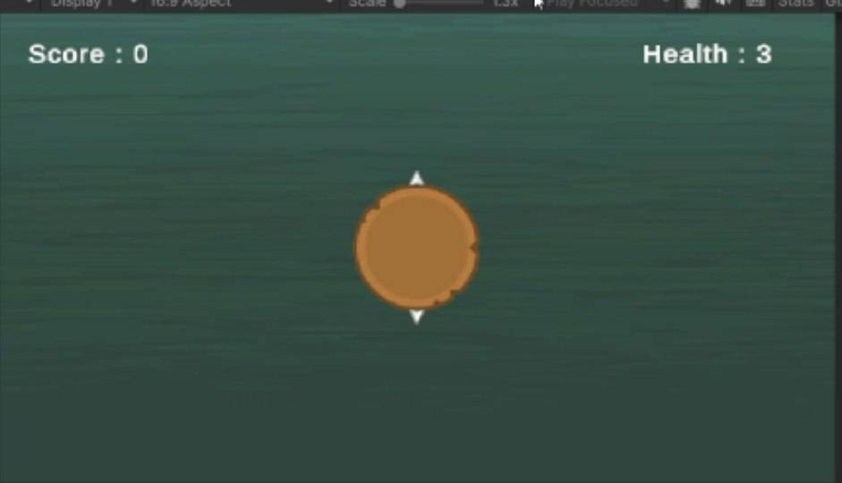
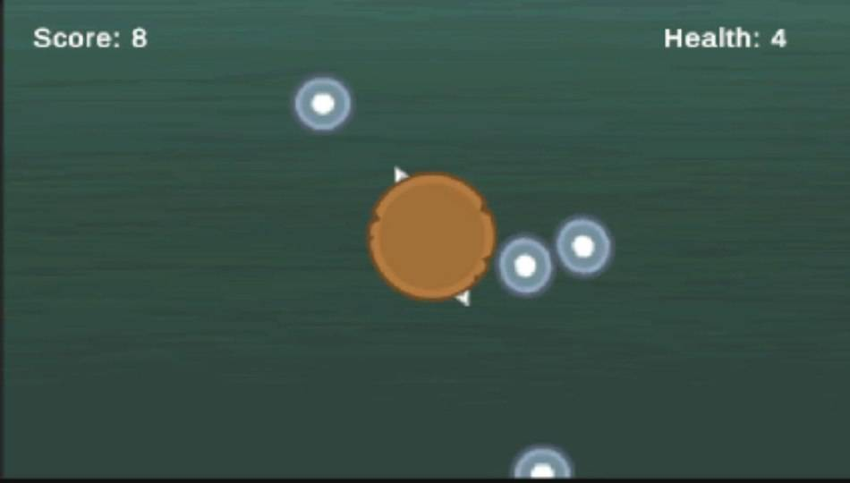

# 🎮 SecondProject

A 2D Unity game project developed using Unity and C#.

## 🎮 About the Game

SecondProject is a 2D game developed as part of my game development journey.

The game features a simple top-down gameplay experience where the player interacts with incoming projectiles while managing health and increasing their score.

## 📸 Screenshots

<p align="center">
  
  
</p>

## 📺 Gameplay

Watch the gameplay demonstration on YouTube:

[▶️ Watch Gameplay on YouTube](https://youtu.be/DTlibpb_Wxg)

## 🛠️ Built With

- Unity
- C#
- Unity 2D

## ✨ Features

- 2D gameplay
- Score system
- Health system
- Interactive gameplay mechanics
- Projectile-based gameplay
- Simple game UI

## 🚀 Getting Started

### Requirements

- Unity
- Git

### Installation

1. Clone the repository:

```bash
git clone YOUR_REPOSITORY_URL
Open the project using Unity Hub.
Select the SecondProject folder.
Open the project with the appropriate Unity version.
📁 Project Structure
SecondProject/
├── Assets/
├── Packages/
├── ProjectSettings/
├── screenshots/
├── .gitignore
└── README.md
🎯 Project Status

🚧 In Development

👤 Developer

Samin Akbari
